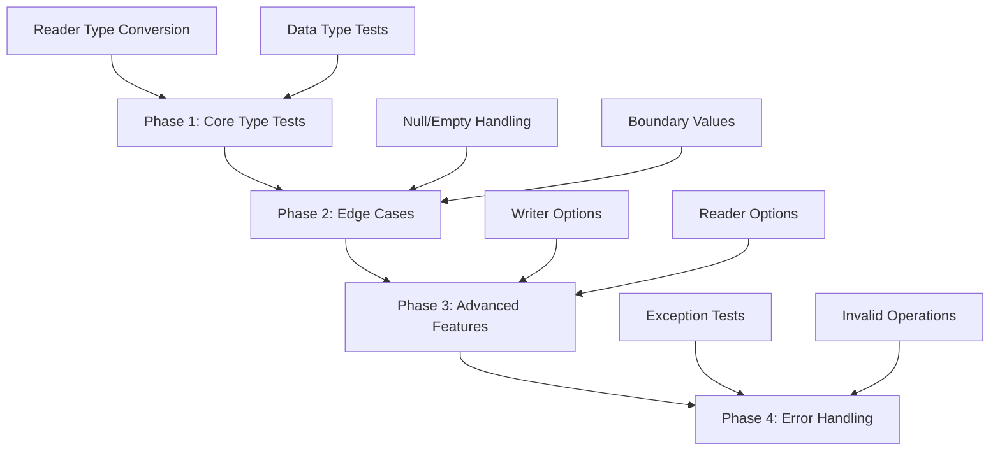

# Test Coverage Improvement Plan for SpreadSheetTasks

## Overview

This plan outlines a strategy to increase test coverage for the SpreadSheetTasks project without introducing breaking changes. The focus is on testing existing public APIs and edge cases that are currently untested.

## Current State Analysis

### Existing Test Files
- [`BasicTests.cs`](source/Tests/BasicTests.cs) - Core read/write functionality
- [`ReaderTests.cs`](source/Tests/ReaderTests.cs) - Reader API tests
- [`WriterTests.cs`](source/Tests/WriterTests.cs) - Writer API tests

### Source Files Under Test
- [`ExcelWriter.cs`](source/SpreadSheetTasks/ExcelWriter.cs) - Abstract writer base class
- [`XlsxWriter.cs`](source/SpreadSheetTasks/XlsxWriter.cs) - XLSX format writer
- [`XlsbWriter.cs`](source/SpreadSheetTasks/XlsbWriter.cs) - XLSB format writer
- [`ExcelReaderAbstract.cs`](source/SpreadSheetTasks/ExcelReaderAbstract.cs) - Abstract reader base class
- [`XlsxOrXlsbReadOrEdit.cs`](source/SpreadSheetTasks/XlsxOrXlsbReadOrEdit.cs) - Reader implementation
- [`BiffReaderWriter.cs`](source/SpreadSheetTasks/BiffReaderWriter.cs) - Binary format reader/writer
- [`ReaderFromList.cs`](source/SpreadSheetTasks/Helpers/ReaderFromList.cs) - Helper for list-based data

---

## Proposed Test Categories

### 1. Reader Type Conversion Tests

**File:** `ReaderTypeConversionTests.cs` (new)

Tests for type-specific getter methods in [`ExcelReaderAbstract`](source/SpreadSheetTasks/ExcelReaderAbstract.cs):

| Test Name | Description | Priority |
|-----------|-------------|----------|
| `GetInt32_FromInt32Column_ReturnsValue` | Read Int32 from integer column | High |
| `GetInt32_FromInt64Column_ConvertsAndReturns` | Int64 to Int32 conversion | High |
| `GetInt32_FromDoubleColumn_ConvertsAndReturns` | Double to Int32 conversion | High |
| `GetInt32_FromStringColumn_ThrowsInvalidCastException` | Invalid cast scenario | Medium |
| `GetInt64_FromInt64Column_ReturnsValue` | Read Int64 from long column | High |
| `GetInt64_FromDoubleColumn_ConvertsAndReturns` | Double to Int64 conversion | High |
| `GetDouble_FromDoubleColumn_ReturnsValue` | Read double value | High |
| `GetDouble_FromIntColumn_ConvertsAndReturns` | Integer to double conversion | High |
| `GetDateTime_FromDateTimeColumn_ReturnsValue` | Read date value | High |
| `GetDateTime_FromNonDateTimeColumn_ThrowsInvalidCastException` | Invalid cast for date | Medium |

### 2. Reader Advanced Feature Tests

**File:** `ReaderAdvancedTests.cs` (new)

Tests for advanced reader functionality:

| Test Name | Description | Priority |
|-----------|-------------|----------|
| `GetNativeValue_ReturnsFieldInfoStruct` | Access native FieldInfo struct | Medium |
| `GetNativeValues_ReturnsFieldInfoArray` | Access entire row as FieldInfo[] | Medium |
| `RowCount_AfterOpen_ReturnsCorrectValue` | Verify RowCount property | Medium |
| `ResultsCount_ReturnsSheetCount` | Verify ResultsCount property | Medium |
| `RelativePositionInStream_ReturnsValue` | Progress tracking during read | Low |
| `UseMemoryStreamInXlsb_True_Works` | XLSB with memory stream mode | Medium |
| `UseMemoryStreamInXlsb_False_Works` | XLSB with buffered stream mode | Medium |
| `Open_WithReadSharedStringsFalse_Works` | Skip shared strings loading | Medium |
| `Open_WithEncoding_Works` | Custom encoding parameter | Low |

### 3. Writer Advanced Feature Tests

**File:** `WriterAdvancedTests.cs` (new)

Tests for advanced writer functionality:

| Test Name | Description | Priority |
|-----------|-------------|----------|
| `WriteSheet_WithOverLimit_TruncatesRows` | Test overLimit parameter | Medium |
| `WriteSheet_WithStartingRow_OffsetsData` | Test startingRow parameter | Medium |
| `WriteSheet_WithStartingColumn_OffsetsData` | Test startingColumn parameter | Medium |
| `AddSheet_WithHiddenTrue_CreatesHiddenSheet` | Hidden sheet creation | Medium |
| `OnCompress_Event_FiresDuringSave` | Compress event verification | Low |
| `On10k_Event_FiresDuringWrite` | Progress event verification | Low |

### 4. Edge Case Tests

**File:** `EdgeCaseTests.cs` (new)

Tests for boundary conditions and special scenarios:

| Test Name | Description | Priority |
|-----------|-------------|----------|
| `Read_EmptyFile_ReturnsNoRows` | Empty Excel file handling | High |
| `Read_EmptySheet_ReturnsNoRows` | Sheet with no data | High |
| `Write_AllNullValues_WritesEmptyCells` | All null data row | High |
| `Write_MixedNullValues_HandlesCorrectly` | Partial null values | High |
| `Write_SpecialCharactersInSheetName_Works` | Unicode in sheet names | Medium |
| `Write_LongSheetName_TruncatesOrHandles` | Sheet name length limits | Low |
| `Write_LargeDataSet_CompletesSuccessfully` | 10000+ rows stress test | Medium |
| `Write_ManyColumns_CompletesSuccessfully` | 100+ columns test | Medium |
| `Read_CellWithFormula_ReturnsValue` | Formula cell handling | Medium |
| `Write_DateTimeMinValue_Works` | DateTime.MinValue edge case | Medium |
| `Write_DateTimeMaxValue_Works` | DateTime.MaxValue edge case | Medium |
| `Write_NegativeNumbers_Works` | Negative value handling | High |
| `Write_VeryLargeDouble_Works` | Large double precision | Medium |
| `Write_VerySmallDouble_Works` | Small double precision | Medium |

### 5. Error Handling Tests

**File:** `ErrorHandlingTests.cs` (new)

Tests for exception scenarios:

| Test Name | Description | Priority |
|-----------|-------------|----------|
| `Open_NonExistentFile_ThrowsFileNotFoundException` | Missing file error | High |
| `Open_InvalidFileFormat_ThrowsException` | Corrupted/invalid file | High |
| `Read_BeforeOpen_ThrowsException` | Invalid operation order | Medium |
| `GetValue_IndexOutOfRange_ThrowsException` | Column index out of bounds | High |
| `GetValues_ArrayTooSmall_HandlesGracefully` | Array size mismatch | Medium |
| `WriteSheet_NoAddSheet_ThrowsException` | Missing sheet initialization | Medium |
| `CreateWriter_EmptyPath_ThrowsException` | Empty file path | Medium |
| `AddSheet_DuplicateName_ThrowsOrHandles` | Duplicate sheet names | Medium |

### 6. Data Type Tests

**File:** `DataTypeTests.cs` (new)

Comprehensive data type handling tests:

| Test Name | Description | Priority |
|-----------|-------------|----------|
| `Write_BooleanTrue_ReadsBackCorrectly` | Boolean true value | High |
| `Write_BooleanFalse_ReadsBackCorrectly` | Boolean false value | High |
| `Write_Decimal_ReadsBackCorrectly` | Decimal precision | High |
| `Write_Float_ReadsBackCorrectly` | Float precision | Medium |
| `Write_Guid_AsString` | GUID handling | Low |
| `Write_TimeSpan_AsDateTimeOrString` | TimeSpan handling | Medium |
| `Write_ByteArray_NotSupportedOrHandled` | Binary data | Low |
| `Write_EmptyString_WritesEmptyCell` | Empty string vs null | High |
| `Write_WhitespaceString_PreservesWhitespace` | Whitespace handling | Medium |

---

## Implementation Order



### Phase 1: Core Type Tests
1. Create `ReaderTypeConversionTests.cs`
2. Create `DataTypeTests.cs`

### Phase 2: Edge Cases
3. Create `EdgeCaseTests.cs`

### Phase 3: Advanced Features
4. Create `ReaderAdvancedTests.cs`
5. Create `WriterAdvancedTests.cs`

### Phase 4: Error Handling
6. Create `ErrorHandlingTests.cs`

---

## Test Infrastructure Recommendations

### Shared Test Helpers

Consider adding a shared helper class to reduce code duplication:

```csharp
// TestHelper.cs
public static class TestHelper
{
    public static DataTable CreateTestDataTable(params Type[] columnTypes)
    public static string GetTempFilePath(string extension)
    public static void CleanupTempFiles()
}
```

### Test Data Constants

```csharp
// TestData.cs
public static class TestData
{
    public const int LargeRowCount = 10000;
    public const int ManyColumnCount = 100;
    public static readonly DateTime TestDate = new(2024, 6, 15);
}
```

---

## Coverage Metrics Goals

| Category | Current Estimate | Target |
|----------|-----------------|--------|
| ExcelReaderAbstract | ~40% | 80% |
| ExcelWriter | ~50% | 85% |
| XlsxOrXlsbReadOrEdit | ~35% | 75% |
| XlsxWriter | ~30% | 70% |
| XlsbWriter | ~30% | 70% |

---

## Non-Goals (Out of Scope)

- Performance benchmarks (covered in Benchmark project)
- Internal/private method testing
- Platform-specific behavior tests
- Multi-threading tests
- Memory leak tests

---

## Notes

- All tests should use `[Collection("Sequential")]` attribute to prevent parallel execution issues
- Tests should clean up created files in `finally` blocks or using `IDisposable`
- Both `.xlsx` and `.xlsb` formats should be tested using `[Theory]` and `[InlineData]`
- Tests should not depend on external files in `TestFiles/` directory when possible